<h1 align="center">
  <a href="https://leoii22.com" target="_blank">🌐 leoii22.com</a>
</h1>

  <em>PhD Student @ UMich | AI Researcher | Open Source Enthusiast</em>

---

## 📊 GitHub Overview

  

## 💻 Tech Stack & 🏆 Achievements

<table width="100%">
  <tr>
    <td width="50%" valign="top">
      
    </td>
    <td width="50%" valign="top">
      
    </td>
  </tr>
</table>

## ⏰ Coding Habits & 📅 Contribution Calendar

<table width="100%">
  <tr>
    <td width="50%" valign="top">
      
    </td>
    <td width="50%" valign="top">
      
    </td>
  </tr>
</table>

## 🌟 Notable Work & Community Impact

<table width="100%">
  <tr>
    <td width="50%" valign="top">
      
    </td>
    <td width="50%" valign="top">
      
    </td>
  </tr>
</table>

## ⭐ Stargazers

  

---

  📊 Metrics powered by <a href="https://github.com/lowlighter/metrics">lowlighter/metrics</a>
   
  🔄 Auto-updated daily

